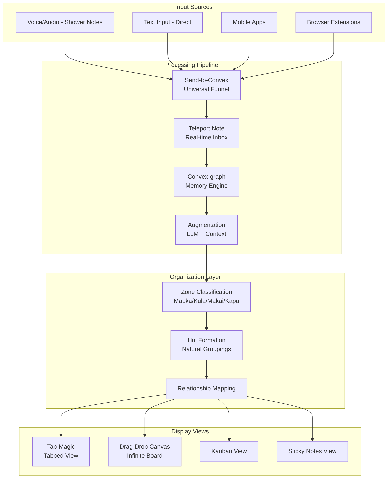

# Hui Hui Manaʻo - Unified System Overview

## Project Vision
A thought capture and organization system that transforms raw, stream-of-consciousness inputs into a living, interconnected knowledge ecosystem using Hawaiian Ahupuaʻa principles and memory-augmented AI.

## Core Architecture Components

### 1. **Convex-graph** - Memory Graph Foundation
**Path**: `/Users/soderstrom/generated_repos/convex_graph`
**Role**: Core memory augmentation engine
- **Features**:
  - Entity storage (people, places, objects)
  - Thought enrichment via OpenAI
  - User-specific memory graphs
  - Async processing pipeline
- **Integration**: Provides the memory context for all incoming thoughts

### 2. **Tab-Magic** - Visual Organization Layer
**Path**: `/Users/soderstrom/Documents/tab-magic/README.md`
**Role**: UI/UX for thought arrangement
- **Features**:
  - Drag-and-drop interface
  - Tab-based organization
  - Visual grouping mechanisms
- **Integration**: Front-end for organizing augmented thoughts into Hui (groups)

### 3. **Profile Onboarder** - Initial Memory Seeding
**Path**: `/Users/soderstrom/generated_repos/profile_onboarder`
**Role**: User onboarding and initial graph population
- **Features**:
  - Structured questionnaire flow
  - Initial entity creation
  - Relationship mapping
- **Integration**: Builds foundational memory graph during user setup

### 4. **Send-to-Convex** - Universal Input Funnel
**Path**: `/Users/soderstrom/generated_repos/sendup_convex`
**Role**: Multi-source thought ingestion
- **Features**:
  - API endpoint for thought submission
  - Source-agnostic design
  - Batch processing capability
- **Integration**: Central intake for all thought sources (voice, text, apps)

### 5. **Teleport Note** - Real-time Inbox
**Path**: `/Users/soderstrom/generated_repos/teleport-note`
**Role**: Live thought reception and initial processing
- **Features**:
  - Real-time updates via Convex
  - Inbox metaphor
  - Quick triage interface
- **Integration**: First stop for incoming thoughts before augmentation

### 6. **Drag-and-drop-simple** - Canvas Interaction
**Path**: `/Users/soderstrom/2025/April/drag-drop-simple`
**Role**: Spatial arrangement testing
- **Features**:
  - Basic drag-drop mechanics
  - Position persistence
  - Collision detection
- **Integration**: Foundation for infinite canvas implementation

### 7. **Shower-notes** - Voice Input Channel
**Path**: `/Users/soderstrom/generated_repos/shower_notes_bolt_try`
**Role**: Audio-to-text capture (conceptual)
- **Features**:
  - STT integration
  - Quick capture UI
  - Hands-free operation
- **Integration**: One of many input channels feeding Send-to-Convex

## Unified Architecture



## Data Flow Architecture

### Phase 1: Capture
- Multiple input sources converge at **Send-to-Convex**
- Raw thoughts stored with metadata (timestamp, source, location)

### Phase 2: Augmentation
- **Teleport Note** receives and queues thoughts
- **Convex-graph** provides memory context
- LLM augments based on:
  - User's entity graph
  - Historical patterns
  - Temporal relationships

### Phase 3: Organization
- Thoughts classified into Ahupuaʻa zones
- Natural Hui (groupings) formed
- Spatial positioning calculated

### Phase 4: Presentation
- Multiple view options available
- User can switch between:
  - **Tab view** (Tab-Magic)
  - **Canvas view** (Drag-drop)
  - **Kanban boards**
  - **Sticky note clusters**

## Key Technical Decisions

1. **Convex as Central Backend**
   - Real-time subscriptions
   - Vector search capabilities
   - Reactive queries
   - Type-safe schema

2. **Two-Card Metaphor**
   - Front: Raw STT/text (preserved authenticity)
   - Back: Augmented version (added context)

3. **Memory Graph Structure**
   ```typescript
   Entities → Relationships → Patterns → Augmentation
   ```

4. **Ahupuaʻa Zone Classification**
   - Mauka 🌋: Visionary/aspirational
   - Kula 🌱: Practical/actionable
   - Makai 🌊: Emotional/relational
   - Kapu 🌫️: Protected/incubating

## Integration Roadmap

### Phase 1: Core Pipeline ✓
- [x] Memory graph (Convex-graph)
- [x] Input funnel (Send-to-Convex)
- [x] Real-time updates (Teleport Note)

### Phase 2: Enhanced Processing
- [ ] Zone classification algorithm
- [ ] Confidence scoring
- [ ] Entity relationship extraction
- [ ] Temporal pattern recognition

### Phase 3: Rich Visualization
- [ ] Unified canvas with multiple views
- [ ] Smooth transitions between views
- [ ] Collaborative features
- [ ] Export capabilities

### Phase 4: Advanced Features
- [ ] Voice input integration
- [ ] Mobile companion app
- [ ] API for third-party integrations
- [ ] ML-powered insights

## System Prompt Integration

The provided system prompt would be enhanced to include:
1. Memory graph context injection
2. Ahupuaʻa zone determination
3. Entity recognition and linking
4. Confidence scoring
5. Hui formation suggestions

## Next Steps

1. **Immediate**: Merge Send-to-Convex with Teleport Note for unified intake
2. **Short-term**: Implement zone classification in Convex-graph
3. **Medium-term**: Build unified UI combining Tab-Magic and Drag-drop
4. **Long-term**: Create mobile app with voice capture

## Code Integration Points

Each codebase contributes specific functionality that should be extracted and unified:

- **Convex-graph**: `agent.ts` enrichment logic → Core augmentation service
- **Tab-Magic**: Tab management → View switching component
- **Profile Onboarder**: Question flow → Initial graph builder
- **Send-to-Convex**: API endpoint → Universal intake service
- **Teleport Note**: Real-time updates → Live feed component
- **Drag-drop-simple**: Position logic → Canvas positioning system

This modular approach allows for incremental development while maintaining a clear vision of the unified system.