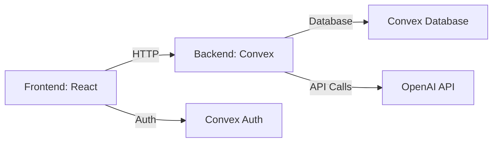
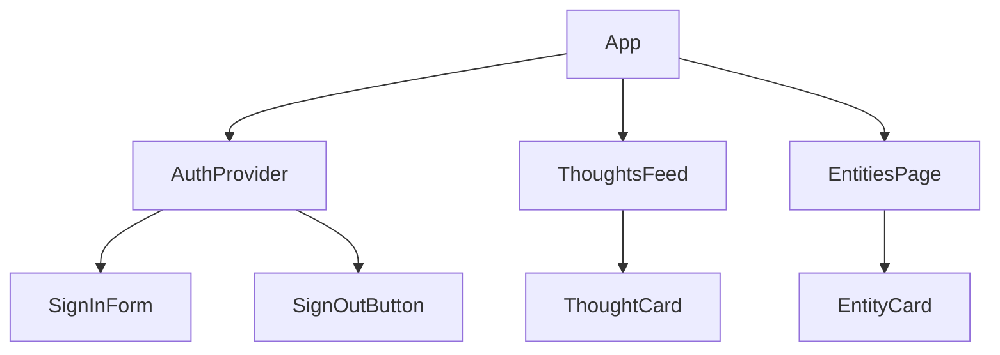

# System Patterns

## Architecture Overview

## Key Technical Decisions
1. **Convex Backend**: Chosen for real-time sync and automatic API generation
2. **React Frontend**: Modern UI framework with excellent Convex integration
3. **Tailwind CSS**: Utility-first CSS for rapid UI development
4. **TypeScript**: Strict typing for both frontend and backend
5. **OpenAI Integration**: For automated thought enrichment and analysis

## Design Patterns
1. **Data Modeling**:
   - Entities: Users can create and categorize entities
   - Thoughts: User-generated content with enrichment capability
   - Relationships: Automatic connections between entities and thoughts

2. **Authentication**:
   - Convex Auth handles user sessions
   - Protected routes based on authentication state

3. **AI Integration**:
   - Background processing for thought enrichment
   - Caching enriched content to reduce API calls

4. **State Management**:
   - Convex reactive queries for real-time updates
   - Local component state for UI interactions

## Component Relationships

## Critical Implementation Paths
1. **Authentication Flow**:
   SignInForm → ConvexAuthProvider → Session Management → Protected Routes

2. **Thought Creation**:
   ThoughtForm → Convex Mutation → Database Insert → OpenAI Enrichment → Update Thought

3. **Entity Management**:
   EntityForm → Convex Mutation → Database Insert → Relationship Mapping